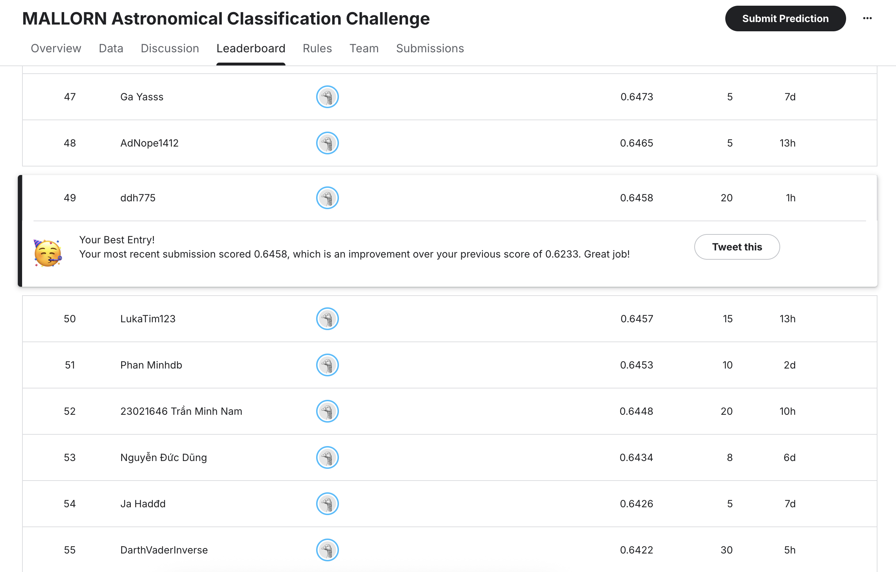

# Báo cáo bài tập lớn UET-ML-2025 Nhóm 5
## Thành viên nhóm:
1. 23021466 - Nguyễn Hồng Anh
2. 23021506 - Trần Ánh Duy
3. 23021546 - Đậu Đức Hiếu

## Hunting Black Holes: TDE Detection from Astronomical Lightcurves
### Mallorn Astronomical Classification Challenge

> **Mục tiêu:** Phân loại sự kiện **Tidal Disruption Events (TDE)** - hiện tượng hố đen xé toạc ngôi sao - khỏi các tín hiệu khác (Supernova, AGN) dựa trên dữ liệu chuỗi thời gian ánh sáng (Lightcurves).

### Kết quả tốt nhất hiện tại trên Public Leaderboard: 0.6458

*Update: 00:00 - 25/12/2025*

---

## Tổng quan

Sự kiện TDE rất hiếm và khó phát hiện do bị lẫn trong hàng nghìn sự kiện nổ siêu tân tinh (Supernova) và nhân thiên hà hoạt động (AGN). Dự án này tập trung giải quyết bài toán mất cân bằng dữ liệu và chuỗi thời gian bằng cách kết hợp **Kiến thức Vật lý Thiên văn** với các thuật toán **Machine Learning Ensemble**.

### Tech Stack
* **Data Processing:** Pandas, NumPy, Scikit-learn
* **Feature Engineering:** tsfresh (Auto-FE), Scipy (Curve Fitting)
* **Machine Learning:** XGBoost, CatBoost, LightGBM (Gradient Boosting)
* **Deep Learning:** Pytorch (LSTM, CNN)
* **Optimization:** Optuna (Bayesian Optimization)

---

## Phương pháp tiếp cận

Dự án được thực hiện qua 4 giai đoạn chính để tối ưu hóa độ chính xác (F1-Score):

### 1. Exploratory Data Analysis (EDA)
Phân tích đặc điểm vật lý để tìm ra sự khác biệt giữa TDE và Nhiễu:
* **Redshift Distribution:** TDE thường được phát hiện ở khoảng cách gần (z < 0.5) do giới hạn độ sáng quan sát.
* **Color-Color Diagram:** TDE tập trung ở vùng "Xanh/Nóng" (u-g < 0), tách biệt với Supernova "Đỏ/Nguội".

### 2. Feature Engineering
Thử nghiệm 3 chiến lược trích xuất đặc trưng:

| Chiến lược | Mô tả | F1-Score | Nhận xét |
| :--- | :--- | :--- | :--- |
| **Baseline** | Thống kê cơ bản (Min, Max, Mean, Std) | **0.39** | Mất thông tin về hình dáng chuỗi. |
| **Auto-FE (tsfresh)** | Fourier Transform, Entropy, Autocorrelation | **0.42** | Có thể có nhiễu, ít ý nghĩa vật lý. |
| **Physics-Based** | **Mô hình hóa Vật lý (Power Law, Bazin, Color)** | **0.63** | Hiệu quả vượt trội nhờ "hiểu" dữ liệu. |

**Các đặc trưng Vật lý quan trọng:**
* **Temperature:** Chỉ số màu $(u-g)$, $(g-r)$ đại diện cho nhiệt độ bề mặt.
* **Luminosity:** Độ sáng thực tế sau khi hiệu chỉnh Redshift.
* **Dynamic Shape:**
    * *TDE:* Fit theo định luật $t^{-5/3}$ (Power Law Decay).
    * *Supernova:* Fit theo hàm Bazin.
    * *AGN:* So sánh với mô hình Random Walk (DRW).

### 3. Ensemble Modeling
Thay vì sử dụng một mô hình đơn lẻ, nhóm sử dụng **Ensemble** gồm 3 thuật toán:
* **CatBoost:** Xử lý tốt dữ liệu nhiễu và categorical features.
* **XGBoost:** Ổn định.
* **LightGBM:** Tốc độ cao, tập trung vào các mẫu khó (Leaf-wise).

### 4. Deep Learning Experiment
Nhóm đã thử nghiệm **Multi-channel LSTM** và **Spectral CNN** (xử lý FFT).
* **Kết quả:** F1 ~ 0.36 (Thấp hơn Machine Learning).
* **Nguyên nhân:** Dữ liệu quá ít (Small Data) và quá thưa (Sparse/Irregular sampling). Deep Learning không đủ dữ liệu để tự học các quy luật vật lý mà Feature Engineering thủ công đã cung cấp sẵn.

---

## Kết quả (Results)

Biểu đồ so sánh hiệu năng qua các giai đoạn phát triển mô hình:

| Model / Approach | Public F1-Score | Ghi chú |
| :--- | :--- | :--- |
| Baseline (Stats) | 0.40 | Khởi điểm |
| XGBoost + tsfresh | 0.42 | Tăng nhẹ |
| **XGB + Physics Features** | **0.63** | Tăng lên mức khá tốt |
| **Ensemble (XGB+Cat+LGBM) + Physics** | **0.6458** | **Best Performance** |
| Deep Learning (LSTM) | 0.36 | DL không đủ tốt trong bài toán này |

> **Kết luận:** Trong bài toán thiên văn với dữ liệu giới hạn, **Domain Knowledge (Kiến thức chuyên gia)** kết hợp với mô hình cây quyết định mang lại hiệu quả tốt hơn so với Deep Learning thuần túy.

---
